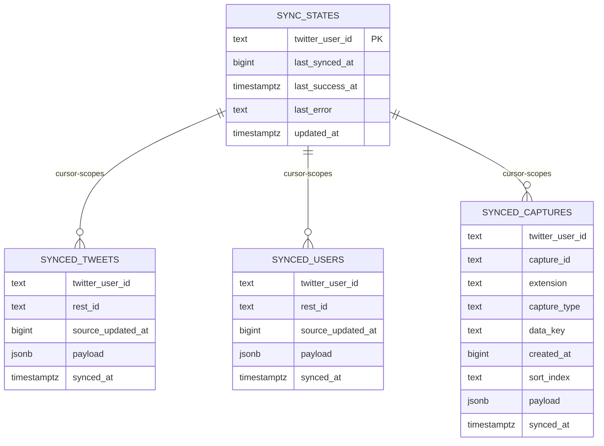

# feat: Add Supabase Incremental Batch Sync

## Overview
为当前浏览器本地采集流程增加“自动同步到 Supabase”的能力：每 15 分钟执行一次增量同步，将本地 IndexedDB 的 `tweets`、`users`、`captures` 以批量 upsert 方式写入 Supabase，并把游标状态持久化到 `sync_states`。

本计划完全继承 brainstorm 已确认范围与边界，不扩大需求，不引入服务端中转（see brainstorm: docs/brainstorms/2026-02-22-supabase-incremental-sync-brainstorm.md）。

## Problem Statement / Motivation
当前项目仅支持本地导出和本地数据库，缺少跨设备可恢复的数据归集能力。用户希望：
- 自动执行，不依赖每次手工导出
- 只同步增量，避免全量重复上传
- 保留抓取来源与顺序语义（`captures`）
- 保持 MVP 复杂度可控

## Proposed Solution
### 方案摘要
新增“Supabase 同步模块”，以浏览器端 `@supabase/supabase-js` 直连 Supabase：
- 同步周期固定 15 分钟（see brainstorm）
- 增量基准为 `tweets/users.twe_private_fields.updated_at`（see brainstorm）
- 同步 `tweets/users/captures`（see brainstorm）
- 游标仅存云端 `sync_states`（see brainstorm）
- 单轮失败最多 3 次指数退避（see brainstorm）
- 只新增/更新，不删除（see brainstorm）
- 500 条/批（see brainstorm）

### 数据模型（Supabase）
- `synced_tweets`
- `synced_users`
- `synced_captures`
- `sync_states`

推荐统一字段：
- `twitter_user_id text not null`
- `payload jsonb not null`
- `source_updated_at bigint not null`
- `synced_at timestamptz not null default now()`

`captures` 补充字段：
- `capture_id text not null`
- `extension text not null`
- `capture_type text not null`
- `data_key text not null`
- `created_at bigint not null`
- `sort_index text`

`sync_states` 字段：
- `twitter_user_id text primary key`
- `last_synced_at bigint not null default 0`
- `last_success_at timestamptz`
- `last_error text`
- `updated_at timestamptz not null default now()`

### 约束与唯一键
- `synced_tweets` unique(`twitter_user_id`, `rest_id`)
- `synced_users` unique(`twitter_user_id`, `rest_id`)
- `synced_captures` unique(`twitter_user_id`, `capture_id`)

### ERD（MVP）

## Technical Considerations
- 认证与密钥：浏览器仅使用 `anon key`，严禁 `service_role` 出现在前端。
- RLS：MVP 采用 `twitter_user_id` 约束写入范围；后续如有滥写风险再升级签名方案。
- 性能：固定 500 条批量 upsert，避免单请求体积过大。
- 幂等：所有写入使用 upsert + 联合唯一键。
- 数据一致性：游标推进必须发生在该轮所有批次成功后。
- 可观测性：为每轮同步记录统计日志（扫描数量/成功数量/失败原因/耗时）。

## System-Wide Impact
- **Interaction graph**: 采集模块写 IndexedDB (`extAddTweets/extAddUsers`) -> 同步调度器读取本地增量 -> Supabase upsert -> 更新 `sync_states`。
- **Error propagation**: Supabase 请求错误在同步模块内聚合，触发指数退避；3 次失败后保留旧游标并记录错误。
- **State lifecycle risks**: 若“数据已写入但游标未推进”，下轮会重复 upsert（可接受，靠幂等消解）；禁止“游标先推进后写入”。
- **API surface parity**: 仅新增同步功能，不改变现有导出与 DB 清理语义。
- **Integration test scenarios**: 需覆盖首次同步、断网恢复、部分批次失败、游标回放、跨账号隔离。

## SpecFlow Analysis
### 关键用户流
1. 用户在设置中配置 Supabase URL/anon key 并启用同步。
2. 系统读取当前 `twitter_user_id` 与云端 `last_synced_at`。
3. 系统扫描本地 `tweets/users` 的 `updated_at > last_synced_at`。
4. 系统分批 upsert `tweets/users`，并按本轮涉及数据补齐 `captures`。
5. 全部成功后推进 `last_synced_at`。

### 边界与缺口
- 未配置或配置无效时，必须降级为“同步关闭”，不影响原功能。
- 切换账号时应使用账号维度游标，不能复用上一个账号游标。
- 本地清库后不应触发云端删除（与已确认策略一致）。

## Acceptance Criteria
- [x] 设置面板可配置 `supabaseUrl`、`supabaseAnonKey`、`syncEnabled`，并持久化到现有 options 体系。
- [x] 启用后每 15 分钟执行一次同步轮次。
- [x] 增量判定仅基于 `tweets/users.twe_private_fields.updated_at`。
- [x] `tweets/users/captures` 均可写入 Supabase，并按 `twitter_user_id` 隔离。
- [x] 单次写入分批 500，写入方式为 upsert，重复执行不产生重复记录。
- [x] 同步失败时执行最多 3 次指数退避重试；最终失败不推进游标。
- [x] 仅新增/更新，无任何云端删除行为。
- [x] `sync_states.last_synced_at` 仅在整轮成功后推进。
- [x] 保持现有本地导出与本地 DB 操作行为不变。
- [ ] 增加最小验证集：调度、增量、重试、游标推进、账号隔离。

## Success Metrics
- 启用同步的实例中，成功轮次占比 >= 95%。
- 常规增量轮次完成时间 <= 10 秒（<= 2000 条场景）。
- 重复同步同一批数据后，云端记录数不异常增长（幂等成立）。

## Dependencies & Risks
- 依赖用户提供有效 Supabase 项目 URL 与 anon key。
- 依赖 Supabase 端先创建表、唯一约束、RLS 策略。
- 风险：仅 `twitter_user_id` 约束在匿名模式下安全性有限；MVP 接受该权衡，后续可升级。
- 风险：浏览器生命周期会中断定时器；下次活跃时需补跑一次同步。

## Implementation Suggestions
- 建议新增模块（示例路径）：
  - `src/core/sync/supabase-client.ts`
  - `src/core/sync/sync-manager.ts`
  - `src/core/sync/types.ts`
- 建议扩展配置：`src/core/options/manager.ts` 的 `AppOptions` 与默认值。
- 建议在 `src/core/settings.tsx` 增加同步配置 UI。
- 建议在数据库层新增“按 updated_at 扫描增量”的读取接口。

## Sources & References
- **Origin brainstorm:** `docs/brainstorms/2026-02-22-supabase-incremental-sync-brainstorm.md`
  - Carried-forward decisions: 15 分钟轮询、增量基准 `updated_at`、同步 `tweets/users/captures`、云端游标、3 次退避重试、仅增改不删、500 分批、`twitter_user_id` 隔离。

### Internal references
- `src/core/database/manager.ts:31`（账号维度 userId 来源）
- `src/core/database/manager.ts:121`（tweets/captures 写入关系）
- `src/core/database/manager.ts:138`（users/captures 写入关系）
- `src/core/database/manager.ts:214`（tweet updated_at 写入）
- `src/core/database/manager.ts:279`（tweets updated_at 索引）
- `src/core/database/manager.ts:297`（users updated_at 索引）
- `src/types/tweet.ts:145`（tweet updated_at 类型定义）
- `src/types/user.ts:124`（user updated_at 类型定义）
- `src/types/index.ts:156`（capture 结构定义）
- `src/core/options/manager.ts:9`（全局配置入口）
- `src/core/settings.tsx:130`（设置页扩展点）

### External references
- Supabase JS `createClient`: [https://github.com/supabase/supabase-js/blob/master/packages/core/supabase-js/README.md](https://github.com/supabase/supabase-js/blob/master/packages/core/supabase-js/README.md)
- Supabase upsert API pattern: [https://context7.com/supabase/supabase-js/llms.txt](https://context7.com/supabase/supabase-js/llms.txt)
- Supabase RLS policy examples: [https://github.com/supabase/supabase/blob/master/examples/prompts/database-rls-policies.md](https://github.com/supabase/supabase/blob/master/examples/prompts/database-rls-policies.md)
- Supabase key safety guidance: [https://github.com/supabase/supabase/blob/master/examples/user-management/expo-user-management/README.md](https://github.com/supabase/supabase/blob/master/examples/user-management/expo-user-management/README.md)

## Research Notes
- 本仓库未发现 `docs/solutions/` 历史案例（0 files），无可复用 institutional learnings。
- 由于涉及外部 API 与数据安全，已执行外部文档研究并纳入安全边界。
