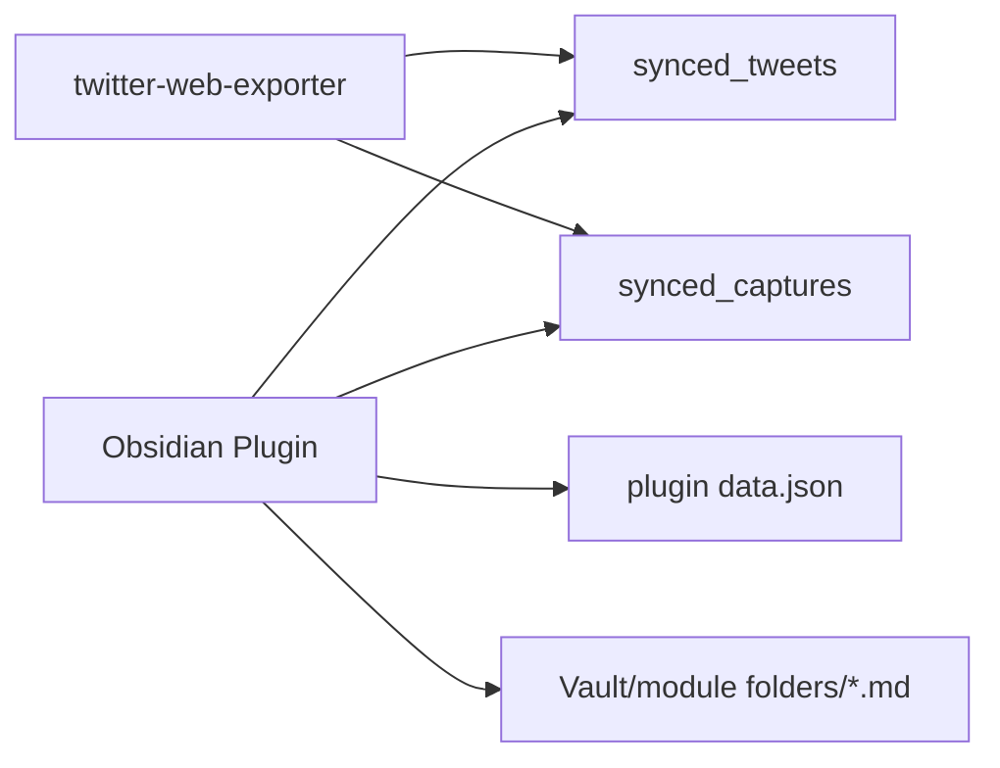

# feat: Add Obsidian Supabase Markdown Sync Plugin

## Overview
为现有 `twitter-web-exporter -> Supabase` 链路增加第二段消费端：单独创建一个 Obsidian 插件仓库，插件启动后按固定间隔轮询 Supabase，把推文同步到指定 Vault 目录中的模块文件夹，并为每条推文生成一个 Markdown 文件。

本计划完全继承 brainstorm 已确认范围与边界，不把实现放回当前仓库，不引入中转后端，不扩展到覆盖/删除语义（see brainstorm: docs/brainstorms/2026-03-06-obsidian-supabase-sync-brainstorm.md）。

## Problem Statement / Motivation
当前仓库已经能把浏览器本地采集结果增量写入 Supabase，但还缺少一个面向知识库的消费端。目标是把 Supabase 中已经稳定落库的推文，自动转成 Obsidian 可直接浏览、搜索、链接的 Markdown 笔记。

这个需求的关键不是“再做一套导出器”，而是：
- 保留模块语义：`bookmarks`、`likes`、`user-tweets` 等要有独立目录（see brainstorm）
- 允许同一推文在多个模块目录中重复出现（see brainstorm）
- 与 Obsidian 使用习惯一致：一条推文一篇 Markdown（see brainstorm）
- 本地文件采用 append-only，避免误覆盖已有笔记（see brainstorm）

## Proposed Solution
### 方案摘要
新建独立 Obsidian 插件仓库，基于官方 sample plugin 结构实现以下能力：
- 插件配置 Supabase URL、anon key、`twitter_user_id`、目标根目录、轮询间隔
- 插件启动后注册定时轮询任务；首次启动时立即跑一次同步
- 同步源使用 `synced_captures` 中 `capture_type = 'tweet'` 的记录，而不是直接扫 `synced_tweets.source_updated_at`
- 每个模块维护自己的本地同步游标，保存在插件 `loadData/saveData` 中，而不是写回 Supabase
- 每轮按模块增量查询新的 capture，再批量拉取对应 tweet，渲染为 Markdown 文件
- 文件只新增，不覆盖，不删除

### 为什么增量源选择 `synced_captures`
虽然 `synced_tweets` 带有 `source_updated_at`，但 append-only 语义决定了 Obsidian 侧不应该因为推文内容更新而回写旧文件。对当前需求，真正的“应当新增文件”的事件是“某条推文首次出现在某个模块中”。

现有仓库中，capture 的唯一键是 `${extName}-${rest_id}`，并且同步到 Supabase 后 `synced_captures` 仍按 `(twitter_user_id, capture_id)` 唯一（see brainstorm: docs/brainstorms/2026-03-06-obsidian-supabase-sync-brainstorm.md, internal refs below）。这正好满足“模块内首次出现一条推文 -> 生成一个文件”的需求。

### 数据流


### 本地状态模型
插件本地状态使用 `loadData/saveData` 持久化：

```ts
interface PluginState {
  version: 1;
  modules: Record<string, {
    lastCaptureCreatedAt: number;
    lastCaptureId: string | null;
    lastRunAt?: string;
    lastError?: string | null;
  }>;
}
```

每个模块单独维护游标，理由：
- 模块目录独立（see brainstorm）
- 同一推文允许跨模块重复，因此不能共用全局 tweet 游标（see brainstorm）
- 某个模块失败时，不应阻塞其它模块推进

### Supabase 查询模型
推荐插件直接调用 Supabase REST，使用 Obsidian 官方网络能力，而不是引入完整 `@supabase/supabase-js` 运行时。理由：
- 查询形态简单，主要是 `select`、过滤、排序、分页
- 更贴近 Obsidian 官方插件实践，便于后续兼容桌面端和移动端
- 减少额外依赖与包体积

建议查询顺序：
1. 从 `synced_captures` 查询指定 `twitter_user_id`、`capture_type='tweet'`、`extension='<module>'` 的新记录
2. 按 `created_at asc, capture_id asc` 排序分页拉取
3. 收集本页 `data_key`（tweet id）
4. 从 `synced_tweets` 查询对应 `rest_id in (...)`
5. 用 `view_payload` 为主渲染 Markdown；若为空则记录 warning 并跳过该条

分页必须显式使用 `range`，不能假设一次能取完所有记录。Supabase 默认单次 `select` 返回上限为 1000 条，计划中建议每页 200-500 条。

### Markdown 输出约定
目标目录示例：

```text
Twitter Archive/
  bookmarks/
    1741222000123-1888888888888888888.md
  likes/
    1741222333444-1888888888888888888.md
```

建议文件名：
- `<capture_created_at>-<tweet_rest_id>.md`

理由：
- 保证 append-only，即便未来需要同推文跨模块重复也天然可区分
- 文件名可排序，接近模块内首次采集顺序
- 避免只用 `rest_id` 时后续重跑或人工文件冲突

建议 frontmatter：
- `tweet_id`
- `module`
- `twitter_user_id`
- `capture_id`
- `capture_created_at`
- `tweet_created_at`
- `author_name`
- `author_screen_name`
- `tweet_url`
- `favorite_count`
- `retweet_count`
- `reply_count`
- `quote_count`
- `bookmark_count`
- `views_count`
- `media`
- `tags`

正文建议：
- 第一段输出推文正文
- 如有媒体，追加媒体原图链接列表
- 末尾保留原始推文链接

### 插件仓库建议结构
- `manifest.json`
- `package.json`
- `src/main.ts`
- `src/settings.ts`
- `src/state.ts`
- `src/supabase-rest.ts`
- `src/sync-engine.ts`
- `src/markdown.ts`
- `src/types.ts`

## Technical Considerations
- 平台范围：MVP 以桌面版 Obsidian 为首要目标，但实现时避免写死 Node-only API，为后续移动端保留空间。
- 安全边界：继续沿用当前 Supabase `anon key + twitter_user_id` 模型；这只适合个人或受控使用，不是强租户隔离（see brainstorm: docs/brainstorms/2026-03-06-obsidian-supabase-sync-brainstorm.md）。
- 同步语义：append-only 明确意味着“推文后续更新不会回写已生成 Markdown”。
- 兼容旧数据：历史 `synced_tweets.view_payload` 可能为空；插件必须给出明确日志和文档指引，提示用户按现有方案重跑 Supabase 全量同步。
- 模块来源：目录名直接使用 `capture.extension`，不另做抽象映射，先遵循当前仓库模块命名。
- 容错：单模块失败不推进该模块游标；其它模块继续执行。

## System-Wide Impact
- **Interaction graph**: Twitter/X 页面采集写入 IndexedDB -> 当前仓库增量 upsert `synced_tweets/synced_captures` -> Obsidian 插件轮询 `synced_captures` -> 批量查询 `synced_tweets` -> 写入 Vault 文件并推进本地模块游标。
- **Error propagation**: Supabase 查询失败、目录创建失败、文件写入失败都在插件内聚合并记录到本地状态；失败模块不推进游标，避免漏同步。
- **State lifecycle risks**: 若“文件已创建但游标未推进”，下轮可能重复尝试写同名文件；应先检测文件是否存在，再视为幂等成功。禁止“游标先推进后写文件”。
- **API surface parity**: 当前仓库不需要修改同步语义；新插件只消费 `synced_tweets`、`synced_captures`，不依赖 `synced_users`。
- **Integration test scenarios**: 首次全量同步、多模块分页同步、同推文跨模块重复、`view_payload` 为空、Vault 中已存在同名文件、单模块失败恢复。

## SpecFlow Analysis
### 关键用户流
1. 用户安装插件，填写 `supabaseUrl`、`supabaseAnonKey`、`twitter_user_id`、输出目录和轮询间隔。
2. 用户启用同步后，插件立即执行一次预检：配置完整、可连通、目标目录可创建。
3. 插件按模块读取本地游标，从 `synced_captures` 拉取新 tweet capture。
4. 插件批量查询 `synced_tweets`，渲染 Markdown，并写入对应模块目录。
5. 只有该模块本页全部落盘成功，才推进该模块游标。
6. 定时器继续轮询，后续只消费新的 capture。

### 关键边界
- 首次同步可能有大量历史记录，必须分页，且不能阻塞 UI 太久。
- 同一推文在多个模块出现时，应分别生成多个文件。
- 同一模块内重复采集同一推文不会生成新 capture；因此不会重复生成文件。
- `view_payload` 为空时，插件不能 silently 生成残缺文件。
- 用户手动移动或删除 Vault 文件后，append-only 模式不负责修复或回补旧文件。

### 实施时默认假设
- 只同步 tweet，不同步 user。
- 只消费当前 `twitter_user_id` 对应数据。
- 不做数据库删除映射，也不做本地 tombstone 机制。
- 不做 Realtime。

## Acceptance Criteria
- [x] 产出独立 Obsidian 插件仓库，能在开发模式下被 Obsidian 加载。
- [x] 插件可配置 `supabaseUrl`、`supabaseAnonKey`、`twitter_user_id`、`vaultRoot`、`pollIntervalMinutes`、`syncEnabled`。
- [x] 插件启用后立即执行一次同步，并按配置间隔继续轮询。
- [x] 同步源使用 `synced_captures` 中 `capture_type='tweet'` 的记录，且按模块分别推进游标。
- [x] 每条 tweet capture 会在对应模块目录生成一个 Markdown 文件。
- [x] 同一 tweet 出现在多个模块时，会在多个目录各生成一份文件。
- [x] 本地文件只新增，不覆盖，不删除；已存在同名文件时视为幂等成功。
- [x] 单模块失败不会推进该模块游标，恢复后可继续补跑。
- [x] 当 `view_payload` 缺失时，插件会记录可见错误或 warning，并给出重跑/回填指引。
- [x] 至少覆盖以下验证：首次同步、分页同步、重复文件幂等、失败恢复、跨模块重复落盘。

## Success Metrics
- 常规轮询轮次在 500 条以内 capture 场景下完成时间 <= 10 秒。
- 对已同步模块重复执行轮询时，不新增重复文件。
- 插件重启后能从上次模块游标继续，不重复跑完整历史。
- 用户不需要手工导出文件即可在 Vault 中看到新增推文。

## Dependencies & Risks
- 依赖当前仓库继续稳定写入 `synced_tweets`、`synced_captures`。
- 依赖 Supabase 端表结构保持与 [docs/supabase-sync-setup.sql](/Users/xiaohansong/projects/twitter-web-exporter/docs/supabase-sync-setup.sql) 一致。
- 风险：当前 RLS 仅约束 `twitter_user_id <> ''`，插件配置中的 `anon key` 与 `twitter_user_id` 组合不具备真正隔离能力；MVP 接受该权衡。
- 风险：append-only 语义意味着 Supabase 中后续 tweet 更新不会反映到旧 Markdown。
- 风险：若用户修改了模块目录内已有文件内容，后续同步不会感知这些人工编辑。

## Implementation Suggestions
- 建议从官方 sample plugin 起步，先完成最小设置页和手动 `Sync now` 命令，再接入定时器。
- 建议首版只支持 tweet 型模块：`bookmarks`、`likes`、`user-tweets`、`user-media`、`home-timeline`、`list-timeline`、`search-timeline`、`community-timeline`、`tweet-detail`。
- 建议把 Supabase 访问封装为纯 REST 层，避免渲染层知道分页和过滤细节。
- 建议在渲染层只接受标准化 `TweetNoteInput`，不要直接散用 Supabase 行结构。
- 建议在插件命令面板提供：
  - `Sync now`
  - `Open last sync log`
  - `Reset module cursors`

## Sources & References
- **Origin brainstorm:** `docs/brainstorms/2026-03-06-obsidian-supabase-sync-brainstorm.md`
  - Carried-forward decisions: 独立插件仓库、直连 Supabase、按模块目录、单条 Markdown、允许跨模块重复、固定间隔轮询、append-only。

### Internal references
- `src/core/sync/sync-manager.ts:17`（Supabase 表名入口）
- `src/core/sync/sync-manager.ts:181`（tweets/users/captures 同步顺序）
- `src/core/sync/sync-manager.ts:184`（通过 `data_key` 关联 capture 与 tweet）
- `src/core/database/manager.ts:130`（tweet capture 的唯一键生成规则）
- `src/core/database/manager.ts:141`（capture `created_at` 的顺序语义）
- `src/types/index.ts:156`（`Capture` 结构定义）
- `src/core/sync/tweet-view.ts:15`（`view_payload` 字段集，可直接供 Markdown 渲染）
- `docs/supabase-sync-setup.sql:7`（`synced_tweets` 结构）
- `docs/supabase-sync-setup.sql:29`（`synced_captures` 结构）
- `docs/solutions/integration-issues/supabase-sync-csp-404-userid-unknown-20260222.md`（`view_payload` 历史回填与 Supabase 真实问题复盘）

### External references
- Obsidian plugin getting started: https://docs.obsidian.md/Plugins/Getting%20started/Build%20a%20plugin
- Obsidian events and cleanup patterns: https://docs.obsidian.md/Plugins/Events
- Obsidian sample plugin: https://github.com/obsidianmd/obsidian-sample-plugin
- Obsidian plugin review checklist: https://docs.obsidian.md/Reference/Plugin%20guidelines/Plugin%20review%20guidelines
- Supabase JavaScript `select` / filtering / pagination reference: https://supabase.com/docs/reference/javascript/select
- Supabase JavaScript `upsert` reference: https://supabase.com/docs/reference/javascript/upsert
- Supabase Row Level Security guide: https://supabase.com/docs/guides/database/postgres/row-level-security

## Research Notes
- Relevant institutional learning only发现 1 条：`docs/solutions/integration-issues/supabase-sync-csp-404-userid-unknown-20260222.md`。其中最重要的可迁移结论是：`view_payload` 可能因历史数据为空而需要重跑；计划中已经把这个前置检查纳入插件行为。
- 当前仓库已具备足够稳定的数据面：`synced_tweets.view_payload` 和 `synced_captures.data_key/extension/created_at` 足以支撑插件 MVP，无需再改当前仓库协议。
